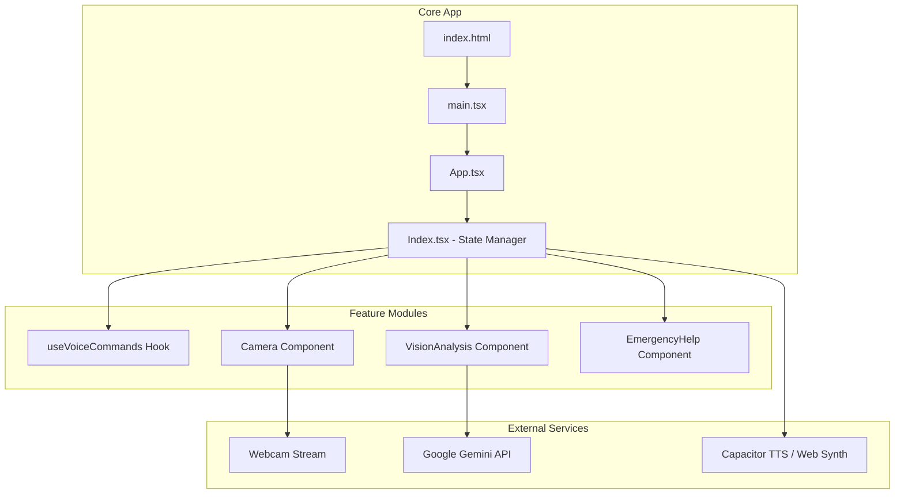
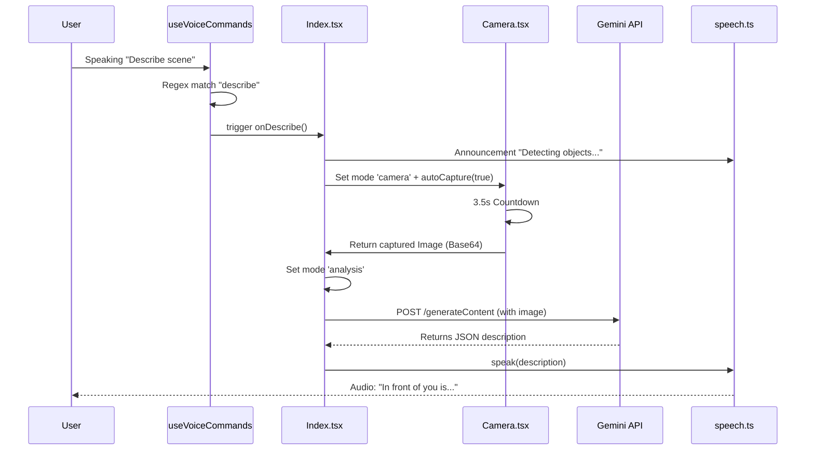

# DoorDrushti - Comprehensive Technical Deep Dive

DoorDrushti is a state-of-the-art assistive vision application built for Android. It leverages Google's Gemini 2.5 Flash model to provide real-time, voice-controlled scene descriptions and OCR (Optical Character Recognition) for visually impaired users.

---

## 🛠️ Technology Stack & Architecture

### Core Technologies
| Category | Technology | Version / Specifics | Rationale |
| :--- | :--- | :--- | :--- |
| **Frontend** | React + Vite | `^18.3.1`, `Vite ^5.4.19` | Fast HMR and lightweight bundle for mobile performance. |
| **Mobile Bridge** | Capacitor | `@capacitor/core ^8.0.2` | Native performance with web-stack flexibility. |
| **Vision AI** | Gemini 2.5 Flash | `v1beta/generateContent` | Ultra-low latency analysis (Flash model optimized for speed). |
| **UI Components** | Radix UI + shadcn | Accessible primitives | Built-in ARIA support and high-contrast styling. |
| **State Management** | React Hooks | `useState`, `useEffect`, `useRef`, `useCallback` | Efficient, local-first state handling without heavy library overhead. |
| **Utility** | TanStack Query | `^5.83.0` | Managed async states for API calls (potential integration). |

---

## 🏗️ System Architecture Diagrams

### 1. High-Level Component Hierarchy



### 2. Sequence Diagram: Voice Triggered Analysis



---

## 🔍 Deep Dive: Core Logic Breakdown

### 1. Voice Integration (`useVoiceCommands.ts`)
The app uses the **Web Speech API** (`window.SpeechRecognition`).
- **Persistence**: The hook implements an `onend` listener that automatically restarts recognition if the app is still in an active state, ensuring the user never has to "manually" re-enable the mic.
- **Command Logic**:
  ```typescript
  if (transcript.includes('describe') || transcript.includes('scene')) {
      optionsRef.current.onDescribe();
  }
  ```
- **Constraint**: Requires a "Secure Context" (HTTPS), which is why local development often requires `localhost` and Capacitor uses `androidScheme: 'https'`.

### 2. AI Prompt Engineering (`VisionAnalysis.tsx`)
The app uses specific system instructions to ensure the AI output is suitable for visually impaired users:
- **Object Mode**: *"Provide a crisp, concise description of the scene in 1-2 sentences. Focus on key objects, people, and actions."*
- **Text Mode**: *"Extract and return all text visible in this image... signs, labels, documents..."*

### 3. Native vs. Web Speech (`speech.ts`)
The app uses a hybrid approach to text-to-speech:
- **Native**: Uses `@capacitor-community/text-to-speech` for high-quality Android system voices.
- **Fallback**: Uses the native browser `speechSynthesis` for web testing.
- **Prioritization**: Native is always preferred on device for better volume control and clearer pronunciation.

### 4. Emergency Subsystem (`EmergencyHelp.tsx`)
- **Web Audio API**: Instead of relying on external audio files, the app generates a raw 800Hz sine wave tone programmatically. This ensures the alert works even if assets fail to load.
- **Tactile Feedback**: Strong vibration patterns (`[500, 200, 500...]`) are used to verify activation for users who cannot see the screen.

---

## 🎨 UI/UX Design Philosophy

### Accessibility (A11y) First
1. **Touch Targets**: Buttons are styled with `size="xl"` to provide large, hit-able areas.
2. **Announcements**: Every state change (switching from menu to camera, analysis starting, etc.) is announced via TTS.
3. **Contrast**: The theme uses `background: 222.2 84% 4.9%` (near black) and `primary: 210 40% 98.1%` (near white) for maximum readability.
4. **Haptics**: Every button press and capture event provides physical vibration feedback.

---

## ⚙️ Configuration & Setup

### Environment Variables
Create a `.env` file in the root:
```bash
VITE_GEMINI_API_KEY=your_google_api_key
```

### Android Permissions
Capacitor requires these in `AndroidManifest.xml`:
- `android.permission.CAMERA`
- `android.permission.RECORD_AUDIO`
- `android.permission.MODIFY_AUDIO_SETTINGS`

### Troubleshooting
- **Mic not working?**: Check if the site is served over HTTPS. On Android, ensure Capacitor's `androidScheme` is `https`.
- **429 API Error**: You've hit the Gemini free tier limit. Wait 60 seconds or use a production key.
- **Camera black screen?**: Ensure no other app is holding the hardware lock on the camera.

---

## 🗺️ Future Roadmap
- [ ] **Real-time Streaming**: Moving from static capture to continuous frame analysis.
- [ ] **Multi-language Support**: Voice commands and TTS in localized languages.
- [ ] **Offline OCR**: Utilizing on-device ML for basic text reading when data is unavailable.
- [ ] **Navigation Mode**: Integrating GPS and indoor mapping for directional assistance.
